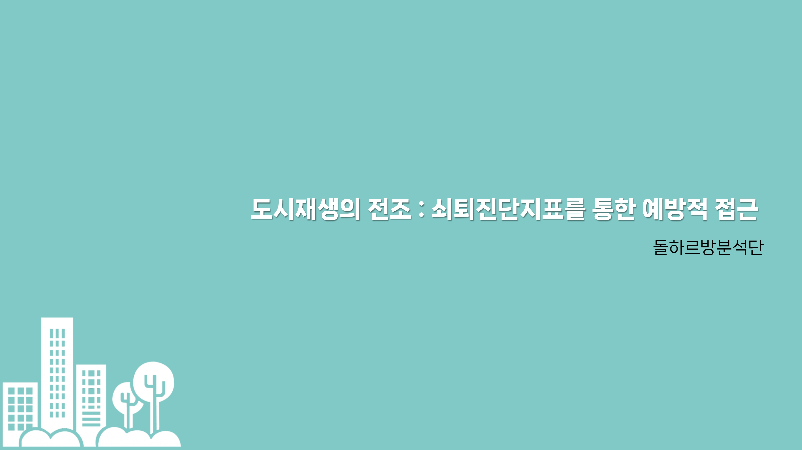

## [(제주도) 소규모 단위의 정밀 도시 쇠퇴도 시각화 분석](https://compas.lh.or.kr/subj/past/info?subjNo=SBJ_2307_002)

### 프로젝트 요약
도시 쇠퇴도 시각화 분석 결과 도출

### 팀명
돌하르방분석단

### 분석 기간 : 2023. 07. 31. ~ 2023. 09. 15.

### 분석 과정
* 개요
* 쇠퇴진단지표
* 선행지표 도출
* 주성분분석 및 클러스터링
* 분석결과 및 제언

### 2023. 09. 25.
1차 평가결과 발표

### 2023. 10.11.
2차 평가 PT

### 2023. 10. 23. 
2차 평가결과 발표 : **장려상 수상**
